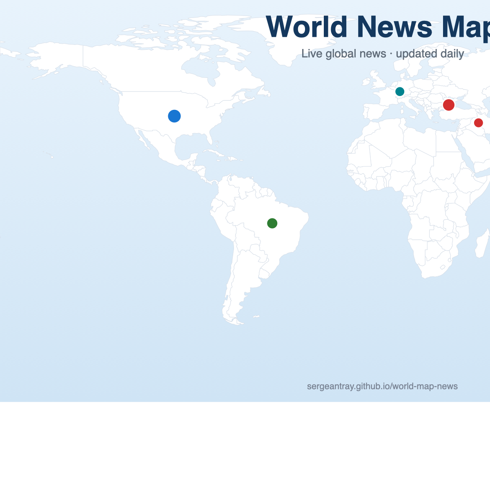

# 🌍 World News Map

A **live world map of today's top news** — war, economy, climate, science, tech, politics, sports and drugs. Click any dot or country border to read the story; zoom in anywhere with your scroll wheel; flip to dark mode with one tap.

**👉 Live at: https://sergeantray.github.io/world-map-news/**



---

## ✨ Features

- **Everything on one map** — every story is geolocated to an exact city (a dot) or a country (a colored border)
- **Topic-colored dots** — each dot's color tells the topic at a glance (red = war, purple = politics, blue = tech…). When several stories share one spot, the dot splits like a **pie — one wedge per topic**; click it to list and pick
- **Live filtering** — toggle a topic chip and dots **recolor live**: pick only Politics and a mixed dot turns fully purple
- **Zoom & pan** — scroll to zoom (up to 10×), drag to pan, one-click reset
- **Dark mode** — 🌙 toggle in the top-right corner (remembered)
- **Filter by topic** — click a tag to toggle it, long-press to show only that topic
- **100% self-contained** — a single HTML file, no map library, no external assets, works offline
- **Auto-updated daily** — fresh headlines every morning

## 🗺️ How it works

- Country borders come from **Natural Earth** (public domain) — every country is its own SVG group, so the whole country highlights as one block
- News is classified (War / Economy / Climate / Science / Tech / Sports / World), then a location is extracted: an exact place (e.g. a city, an earthquake zone) → a dot; a country-level story (e.g. "Japan's economy") → a colored border
- The map is a pure **SVG generated in Python** — same projection for base map and markers, so nothing can drift

## 🛠️ Tech

| Piece | What |
|---|---|
| Map | Hand-built SVG (equirectangular, 2000×1000) from Natural Earth GeoJSON |
| Interaction | Vanilla JavaScript — no Leaflet, no D3, no frameworks |
| News | Daily feeds from major outlets (NYT etc.), fetched by a scheduled script |
| Hosting | GitHub Pages (this repo) |

## 🔄 Updates

The map rebuilds and re-deploys automatically every morning (a scheduled job copies the generated HTML here and pushes). You can also run it manually:

```bash
cd /Users/celinezl/Desktop/Publish/world-news-map
cp ../../News/world-news-map.html index.html
git add -A && git commit -m "update map" && git push
```

## 📄 License

The news links belong to their respective publishers. Map borders: Natural Earth (public domain). Code: free to use.
